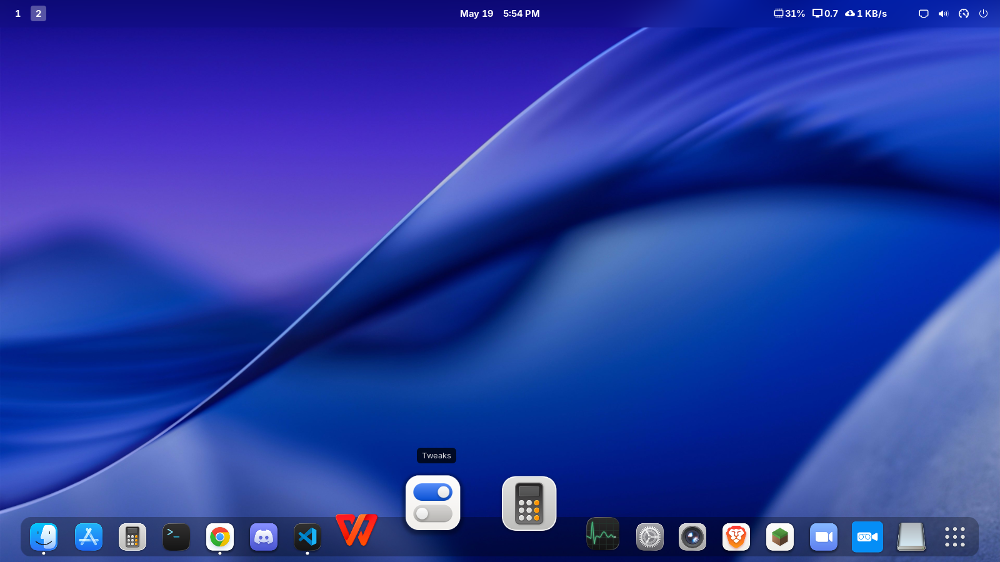
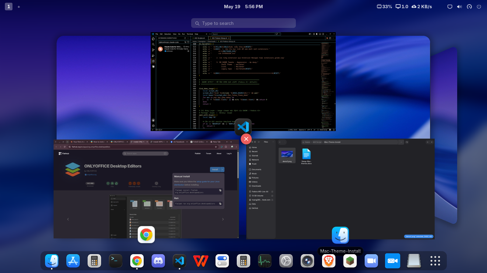
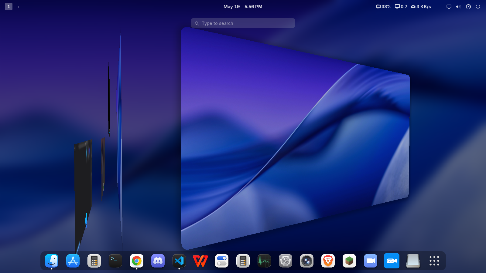
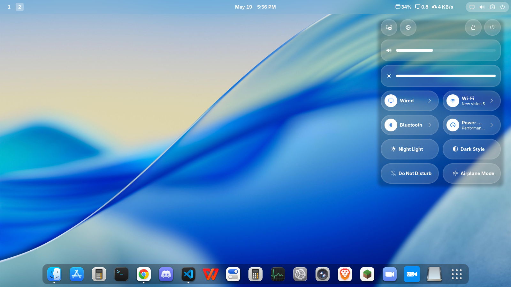

<div align="center">

#  Fedora AIO Setup Scripts


</div>

---

## 📸 Demo Scripts

> Giao diện interactive menu khi chạy script


## 🍎 Demo MacOS Tahoe Theme cho GNOME

> Giao diện sau khi cài MacTahoe Theme

| | |
|:---:|:---:|
|  |  |
|  |  |

---

## ✨ Tính năng

- 🖥️ **Interactive TUI** — Checkbox menu, chọn những gì cần cài, bỏ qua những gì không cần
- ⚡ **DNF5** — Dùng hoàn toàn DNF5, không có lệnh DNF4 cũ
- 🔍 **Auto-detect** — Tự nhận biết Desktop Environment (GNOME / Hyprland / KDE...)
- 📦 **Auto Flathub** — Tự động enable Flathub khi chọn app Flatpak
- 🎨 **MacOS Tahoe Theme** — GTK Theme + Icon + Wallpapers cho GNOME
- 🔄 **4 bước rõ ràng** — Cơ bản → Chọn app → Xác nhận → Cài đặt

---

## 📦 Danh sách ứng dụng có thể cài

| Ứng dụng | Loại | Ghi chú |
|----------|------|---------|
| Brave Browser | DNF | Repo chính thức |
| Google Chrome | RPM | Tải từ Google |
| VLC + FFmpeg | DNF | Cần RPM Fusion |
| Zoom | RPM | Tải từ zoom.us |
| Discord | Flatpak | Flathub |
| Blue Recorder | Flatpak | Flathub |
| Fcitx5 + Unikey | DNF | Gõ tiếng Việt |
| Git + Fastfetch | DNF | Dev tools |
| OnlyOffice | Flatpak | Flathub |
| WPS Office | Flatpak | Flathub |
| Spotify | Flatpak | Flathub |
| TLauncher Minecraft | SDKMAN | Java 17.0.12 Temurin bắt buộc |
| Fedora Hyprland (JaKooLit) | Git | Interactive installer |
| Fedora Hyprland (ML4W Stable) | Curl | ml4w.com/os/stable |
| Fedora Hyprland (ML4W Rolling) | Curl | ml4w.com/os/rolling |

---

## 🚀 Cách cài đặt

### Yêu cầu
- Fedora **41 trở lên**
- Kết nối Internet
- **Không chạy bằng root** (script tự gọi sudo khi cần)

### Các bước

**1. Cài Git**
```bash
Sudo dnf install git -y
```

**2. Clone repo**
```bash
git clone https://github.com/Hoangtqm/Fedora-AIO-Setup-Scripts.git
```

**3. Vào thư mục**
```bash
cd Fedora-AIO-Setup-Scripts
```

**4. Cấp quyền thực thi**
```bash
chmod +x AIO-Fedora-Setup.sh
```

**5. Chạy script**
```bash
./AIO-Fedora-Setup.sh
```
**Hoặc chạy full Scripts cùng một lúc**
```bash
Sudo dnf install git -y
git clone https://github.com/Hoangtqm/Fedora-AIO-Setup-Scripts.git
cd Fedora-AIO-Setup-Scripts
chmod +x AIO-Fedora-Setup.sh
./AIO-Fedora-Setup.sh
```
---
##

---

## 🎨 MacOS Tahoe Theme cho GNOME

Script sẽ tự động phát hiện GNOME và hỏi bạn có muốn cài theme không.

Theme bao gồm:
- **GTK4/3 Theme** — macTahoe
- **Icon Theme** — MacTahoe
- **Wallpapers** — macOS Tahoe backgrounds

Sau khi cài, mở **GNOME Tweaks → Appearance** để áp dụng:

---

## ⚠️ Lưu ý

- Script yêu cầu **Fedora 41+** (DNF5 mặc định)
- **TLauncher Minecraft** bắt buộc dùng **Java 17** — script tự cài đúng version qua SDKMAN
- Các app Flatpak sẽ **tự động enable Flathub** nếu chưa có
- Nếu không phải GNOME, các mục GNOME-only sẽ bị vô hiệu hoá tự động

---

## 📖 Hướng dẫn cài MacTahoe Theme
-Sau khi nhấn y và chờ quá trình cài mac theme hoàn tất
Xem file hướng dẫn chi tiết (có ảnh minh hoạ) tại:
- 📄 **Offline**: `~/Mac-Theme-Install/Setup-Mac-themes.docx`
- 🌐 **Online**: [Google Docs — Hướng dẫn Setup Mac Themes](https://docs.google.com/document/d/18JCycVsugTkMA7JXGYiuwgSTse80--oI/edit?usp=sharing&ouid=113234984388764662222&rtpof=true&sd=true)

---
<div align="center">

Made with ❤️ cho cộng đồng Linux Việt Nam 🇻🇳

**[⭐ Star nếu thấy hữu ích!](https://github.com/Hoangtqm/Fedora-AIO-Setup-Scripts)**

</div>
